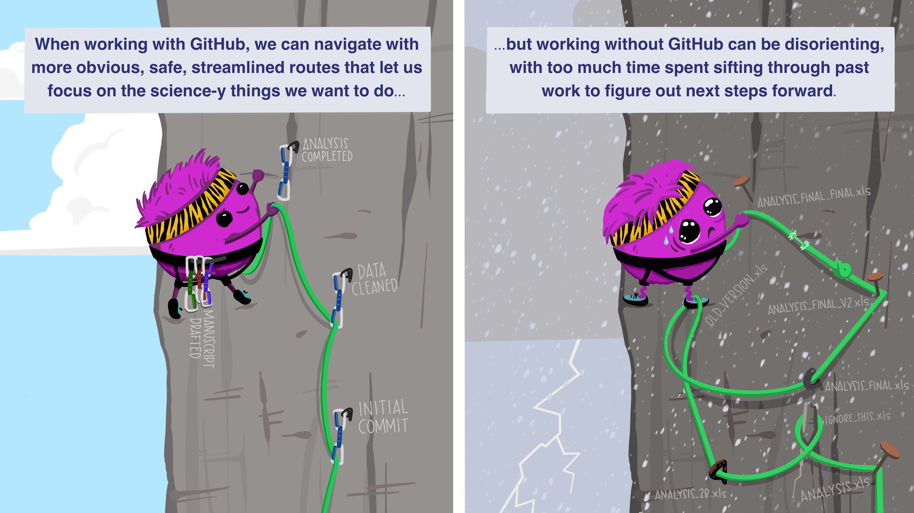

## Slide Accessibility Note
- **Title Background Image Alt-Text:** A scenic photograph of three different penguin species (Adelie, Chinstrap, Gentoo) standing on ice in the Palmer Archipelago, Antarctica.
- **Speaker Notes:** These slides are designed to be read alongside the live-coding script.

<!-- visual-aid: week_01 -->
## The Whole Game Map

::: {.diagram-flow aria-label="Course workflow from question to shared evidence"}

Ask a field question

-&gt;

Sketch the graph

-&gt;

Write reproducible code

-&gt;

Render and inspect

-&gt;

Commit the evidence

:::

Use this map to track where each live-coding step fits in the larger workflow.

## Today: Turn Your Graph into an Assignment

1. In Classroom 50, create your private Assignment 01 repository.
2. Clone it and open `assignment.qmd`.
3. Rebuild the graph you explored: body mass vs. flipper length, colored by species.
4. Make it readable, explain one pattern, render, commit, and push.

**Due:** Tuesday, September 15, 2026, 11:59 PM Central Time.

::: {.notes}
**Speaker Notes:**
Start with the graph students explored before the break. The point is not to
start a different exercise; it is to turn that exploratory graph into a small,
reproducible submission. Demonstrate the workflow in this order: open the
Classroom 50 assignment, create the private repository, clone it, open
`assignment.qmd`, move the familiar `ggplot()` mapping into the assignment,
render, inspect the HTML, commit, and push. Do not promise an accept link on
this slide: show the current Classroom 50 page or post the link once the
assignment is registered.
:::

## Choose One Git Path

- **GitHub Desktop:** use it if it opens; no terminal required.
- **Positron Source Control:** use the Git panel if Git is installed.
- Both paths end the same way: clone → fetch/pull → edit → commit → push → verify on GitHub.
- If an app will not open, your repository is safe on GitHub: take a screenshot and use the other path or ask for help.

::: {.notes}
**Speaker Notes:**
Students do not need the `gh` command-line tool for this assignment. Start by
asking who has a working GitHub Desktop and direct them to that path. For students using
Positron, demonstrate **New Folder from Git** and the **Source Control** icon
in the left Activity Bar. Explain the vocabulary before clicking anything:
clone makes the first local copy, fetch checks for remote changes without
changing their files, pull brings those changes into the local copy, commit
makes a named local checkpoint, and push sends that checkpoint to GitHub.
The book's "Getting your assignment repository" section gives the click-by-click
directions for both paths.
:::

## Why Keep GitHub in the Loop?

{fig-alt="Two-panel illustration comparing a researcher using GitHub to follow a clear route through a climbing landscape, with labeled checkpoints for an initial commit, a cleaned dataset, and completed analysis, to a researcher without GitHub tangled in multiple poorly named analysis files in a snowstorm." height=500}

Illustration by <a href="https://www.allisonhorst.com/git-github">Allison Horst</a>, <a href="https://creativecommons.org/licenses/by/4.0/">CC BY 4.0</a>.

::: {.notes}
**Speaker Notes:**
This image is a visual metaphor, not a required decoding task. Say the point
plainly: GitHub gives a project named checkpoints and a shared version of the
work; without those, it is easy to lose track of which file is current. Connect
the three visible ideas to today's actions: clone the shared starting point,
commit named checkpoints, and push the current version for others to review.
:::

## How To Use Today

- Type along in the follow-along script.
- Ask questions during the checkpoints.
- Keep the goal small: one plot, one interpretation, one push.

<a class="script-download" href="../scripts/week_01_follow_along.R" download style="background-color: #d00000 !important; color: #fff !important;">Download the Assignment 01 follow-along script (.R)</a>

::: {.notes}
**Speaker Notes:**
This deck is the narrative layer, not the whole lesson. We will use it to orient ourselves, but the instructor script is the real teaching artifact.
:::

## Why the "Whole Game"?

- We start by doing, not just installing.
- You will load data, make a plot, and interpret it TODAY.
- We will spend the rest of the semester unpacking HOW it works.

::: {.notes}
**Speaker Notes:**
Welcome to NRES 800. We use a 'Whole Game' approach, inspired by David Perkins. Instead of spending weeks learning about file types and syntax, we are going to build a full analysis today. This gives you the 'big picture' context for everything else we'll learn.
:::

## Learning Objectives

1. Create a private weekly repository through Classroom 50 and clone it.
2. Move a familiar `ggplot2` graph into a Quarto assignment.
3. Render and inspect a Quarto document (`.qmd`).
4. Commit and push a reproducible result to GitHub.

::: {.notes}
**Speaker Notes:**
These four objectives are the technical foundation of the course. If you can do these four things by the end of today, you are 100% on track.
:::

## Today's Dataset: Palmer Penguins

- Data on three penguin species in Antarctica.
- Variables: bill length, flipper length, body mass, sex.
- A classic dataset for learning visualization.

::: {.notes}
**Speaker Notes:**
The palmerpenguins dataset is a modern alternative to the classic 'iris' dataset. It's real ecological data collected by Dr. Kristen Gorman at the Palmer Station.
:::

## Live Coding: Section 1

- Open your project in RStudio.
- Open `scripts/week_01_follow_along.R`.
- Type along as we build the plot.

::: {.notes}
**Speaker Notes:**
Now, please switch over to RStudio. We are going to build our first plot. Remember: don't just watch me—type the code yourself. The muscle memory of typing is how you learn the syntax.
:::

## The Challenge [45 mins]

### Problem: The 30-Minute Analyst

- Load the `palmerpenguins` data.
- Create a scatterplot of body mass vs flipper length.
- Color the points by species.
- **Extension:** Add professional labels and a theme.
- **Base goal:** Make the plot work and make the mapping correct.
- **Extension goal:** Make the plot readable without explanation.

::: {.notes}
**Speaker Notes:**
You have 45 minutes to work on this challenge. If you finish the base goal early, try the extension. The extension asks you to add labels like title, x-axis, and y-axis.
:::

## Verification

- Does the Quarto document render to HTML?
- Can you explain why `species` belongs inside `aes()`?
- Did you commit and push the rendered result?

::: {.notes}
**Speaker Notes:**
Before you leave, verify three things: render, explanation, and GitHub push. If one of those is missing, the assignment is not done yet.
:::

::: {.notes}
**Speaker Notes:**
Before you leave, you must verify your work. Render the document. If it doesn't render, we need to fix it before you go. Finally, push to GitHub. If it's not on GitHub, it doesn't exist for grading!
:::
